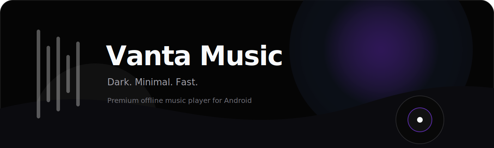
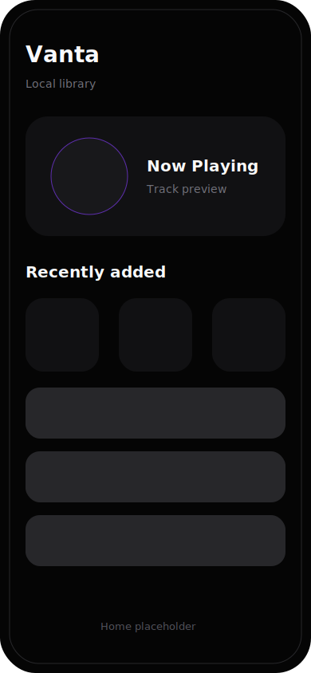
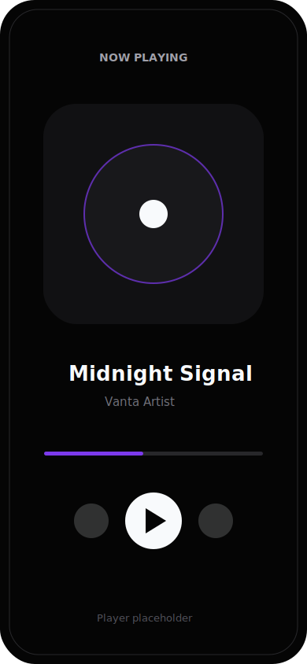
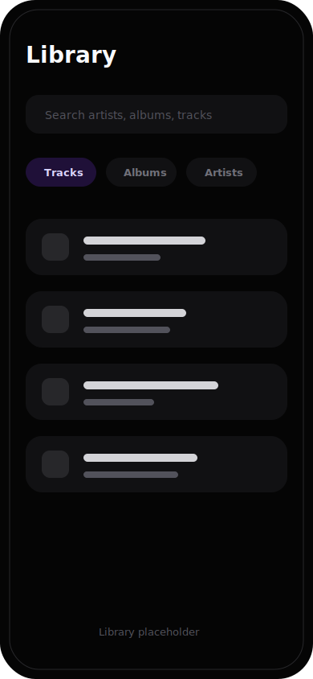

<div align="center">

<!-- Logo / Banner Placeholder -->


# Vanta Music

### A modern, minimal and performance-first music player.

Vanta Music is a premium music player built with Flutter, focused on local/offline music, fluid UX, clean architecture and future self-hosted music streaming support.

<br />


</div>

---

## Overview

**Vanta Music** is an Android-first music player designed for people who care about performance, visual polish and a refined offline listening experience.

The project aims to combine the simplicity of a local music player with the power of future self-hosted integrations such as **Navidrome** and **Jellyfin**.

The visual direction is dark, minimal and premium, inspired by the clean system aesthetic of **Nothing OS**.

---

## Screenshots

> Screenshots will be added as the UI stabilizes.

<div align="center">

| Home | Player | Library |
|---|---|---|
|  |  |  |

</div>

---

## Current beta scope

Vanta Music is being prepared for an internal Android beta focused on daily local playback.

### Included now

- Local music playback from MediaStore and manually selected folders.
- FLAC and MP3 playback.
- Background playback with notification, lockscreen, and media controls.
- Persistent queue/session restore.
- Local playlists, favorites, recently played, and listening stats.
- Cached artwork for lists and player surfaces.
- Dark, minimal, portrait-first UI.

### Not in this beta

- Navidrome, Jellyfin, and YouTube Music integrations.
- Metadata editing.
- Cloud sync.
- Desktop/iOS support.

---

## Features

### Current focus

- 🎵 Local/offline music playback
- ⚡ Fast and responsive user experience
- 🌑 Dark, minimal and premium interface
- 🎧 Background audio playback
- 🧱 Clean and scalable architecture
- 🗄️ Local persistence with SQLite
- 📱 Android-first experience
- 🖼️ Cached artwork for local tracks
- 🎼 FLAC support

### Planned features

- 🔍 Advanced music library indexing
- 🧠 Smart playlists
- 🧾 Metadata reading and editing
- 🖼️ Album artwork management
- 🔄 Sync support
- ☁️ Navidrome integration
- 🪼 Jellyfin integration
- 🖥️ Linux and Windows desktop support
- 🍎 iOS support

---

## Tech Stack

| Area | Technology |
|---|---|
| Framework | Flutter |
| Language | Dart |
| Audio playback | just_audio |
| Background audio | audio_service |
| State management | Riverpod |
| Local database | Drift / SQLite |
| Primary platform | Android |
| Future platforms | Linux, Windows, iOS |

---

## Project Philosophy

Vanta Music is built around a few core principles:

### Performance first

The app should feel fast, lightweight and reliable even with large local music libraries.

### Minimal but expressive

The interface should stay clean, dark and focused, without sacrificing personality or visual quality.

### Offline by default

Local music playback is the foundation. Network features should enhance the experience, not replace it.

### Clean architecture

The codebase should be easy to maintain, test and extend as the project grows.

### Future-ready

The architecture should support future integrations with self-hosted music servers and desktop platforms.

---

## Getting Started

### Requirements

Before running the project, make sure you have:

- Flutter SDK installed
- Dart SDK installed
- Android Studio or Android SDK configured
- A connected Android device or emulator

Check your environment:

```bash
flutter doctor
```

---

## Installation

Clone the repository:

```bash
git clone https://github.com/your-username/vanta_music.git
cd vanta_music
```

Install dependencies:

```bash
flutter pub get
```

---

## Running the Project

Run on Android:

```bash
flutter run
```

Run code generation if needed:

```bash
dart run build_runner build --delete-conflicting-outputs
```

Run tests:

```bash
flutter test
```

Build a local release APK:

```bash
flutter build apk --release
```

---

## Android beta

Beta APKs are available from the repository **Releases** page.

Open the latest Vanta Music beta prerelease, then download the APK from **Assets**.

---

## Project Structure

```text
lib/
├── app/                  # App shell, router, theme
├── features/
│   ├── library/          # Local library, permissions, folders, screens
│   ├── library_intelligence/ # Favorites, recents, play stats
│   ├── player/           # audio_service, just_audio, player UI, session
│   ├── playlists/        # Local playlists
│   └── providers/        # Local and future provider abstractions
├── shared/               # Artwork cache, widgets, utilities
└── main.dart             # App entry point
```

---

## Internal beta checklist

Before sharing a build, run through [`docs/internal-beta-checklist.md`](docs/internal-beta-checklist.md).

Quick gate:

- [ ] `flutter test`
- [ ] `flutter build apk --release`
- [ ] Long background playback test
- [ ] Notification/lockscreen controls test
- [ ] Large-library scroll test
- [ ] No secrets or local files tracked by Git

---

## Roadmap

### Phase 1 — Foundation

- [ ] Project architecture
- [ ] Local database setup
- [ ] Audio playback foundation
- [ ] Background audio service
- [ ] Initial dark UI system

### Phase 2 — Local Music Experience

- [ ] Scan local music files
- [ ] Build music library
- [ ] Album, artist and track views
- [ ] Full player screen
- [ ] Queue management

### Phase 3 — Premium UX

- [ ] Smooth transitions
- [ ] Mini player
- [ ] Search
- [ ] Playlist support
- [ ] Metadata improvements

### Phase 4 — Sync & Self-hosted

- [ ] Navidrome support
- [ ] Jellyfin support
- [ ] Account/session layer
- [ ] Library sync
- [ ] Offline caching strategy

### Phase 5 — Multi-platform

- [ ] Linux support
- [ ] Windows support
- [ ] iOS support

---

## Current Status

Vanta Music is in **internal beta preparation**. The current goal is daily-use stability before large new features.

---

## Design Inspiration

Vanta Music takes inspiration from:

- Nothing OS visual language
- Minimal premium audio apps
- Dark-first interfaces
- High-contrast typography
- Smooth, focused mobile experiences

The goal is not to copy an existing product, but to build a music player with its own identity: quiet, dark, elegant and fast.

---

## Future Self-hosted Support

Vanta Music is planned to support self-hosted music ecosystems:

| Service | Status |
|---|---|
| Navidrome | Planned |
| Jellyfin | Planned |
| Sync | Planned |
| Offline cache | Planned |
| Desktop clients | Planned |

---

## Contributing

Contributions are welcome once the project foundation becomes stable.

For now, the best way to contribute is by:

- Opening issues with ideas or bugs
- Suggesting UX improvements
- Reviewing architecture decisions
- Testing on different Android devices

Before contributing code, please open an issue to discuss the change.

---

## License

License is not defined yet.

```text
TBD
```

---

<div align="center">

**Vanta Music**  
Dark. Minimal. Fast.

</div>
